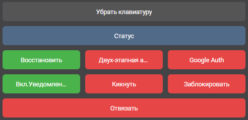

# Привязка Бота ВК

### Шаг 1: Привязка

Для того чтобы привязать бота необходимо зайти на сервер, после чего в [личные сообщения группы](https://vk.me/hyneo) написать:


!аккаунт привязать <никнейм>


> где никнейм - ваш никнейм

### Шаг 2: Код

Вы получите код сообщением в игре в чате, этот код следует вставить в сообщения группы такой командой:


!аккаунт код <код>


> где код - код данный в чате игры.

### Шаг 3: Возможности

После чего вы получите панель управлением аккаунта.

### Возможности панели управления:

* Узнать статус нажав на кнопку "**Статус**", где и что с вашим аккаунтом.
* Восстановить аккаунт нажав на кнопку "**восстановить**", сгенерируется новый пароль.
* Включить нажав на кнопку "**Двух-этапную аутентификацию**" после ввода пароля в игру вас в личных сообщениях затребует подтвердить вход.
* **Google Auth** - вход через QR-код.
* **Уведомления** - их так же можно отключить если вам надоели постоянные сообщения о входе и выходе из игры.
* **Кикнуть** - данную функцию используют если вас например взломали.
* **Заблокировать** - вы можете заблокировать свой аккаунт.
* **Отвязать** - отвязка игрового аккаунта от аккаунта вк.
